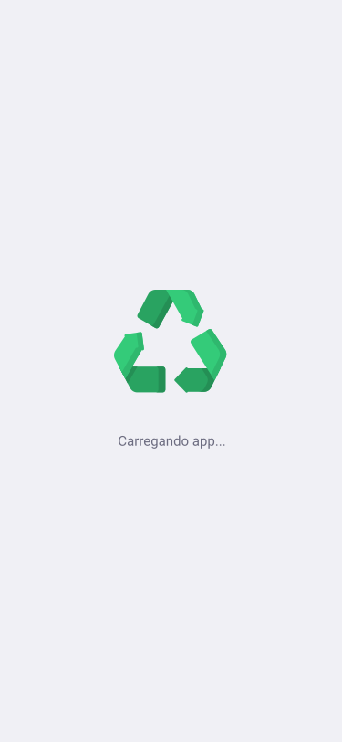

<h1 align="center">
    
</h1>

<h4 align="center"> 
	:construction: NextLevelWeek 1.0 🚀 In progress.. :construction:
</h4>

## Project

Ecoleta is a project developed based on international environment week.
That aims to connect people to companies that collect specific waste such as light bulbs, batteries, cooking oil, etc.

<h1 align="center">
    
</h1>

<h1 align="center">
    
    
    
</h1>

## Technologies

This project was developed with the following technologies:

- [Node.js][nodejs]
- [TypeScript][typescript]
- [React][reactjs]
- [React Native][rn]
- [Expo][expo]

## Layout

To access the layout use [Figma](https://www.figma.com/file/1SxgOMojOB2zYT0Mdk28lB/).

## How To Use

To clone and run this application, you'll need [Git](https://git-scm.com), [Node.js][nodejs] + [Yarn][yarn] installed on your computer.

From your command line:

### Install API

```bash
# Clone this repository
$ git clone https://github.com/DanielObara/NLW-1.0

# Go into the repository
$ cd server

# Install dependencies
$ yarn install

# Run Migrates
$ yarn knex:migrate

# Run Seeds
$ yarn knex:seed

# Start server
$ yarn dev

# running on port 3333
```

### Install Front-end

```bash
# Go into the repository
$ cd frontent

# Install dependencies
$ yarn install

# Run
$ yarn start

# running on port 3000
```

### Install Mobile

```bash
# Go into the repository
$ cd mobile

# Install dependencies
$ yarn install

# Run
$ yarn start

```

Made with ♥ by Wanderson Passos Barcelos [LinkedIn](https://www.linkedin.com/in/wanderson-passos-barcelos-ab196872/)

[nodejs]: https://nodejs.org/
[typescript]: https://www.typescriptlang.org/
[expo]: https://expo.io/
[reactjs]: https://reactjs.org
[rn]: https://facebook.github.io/react-native/
[yarn]: https://yarnpkg.com/
[vs]: https://code.visualstudio.com/
[vceditconfig]: https://marketplace.visualstudio.com/items?itemName=EditorConfig.EditorConfig
[vceslint]: https://marketplace.visualstudio.com/items?itemName=dbaeumer.vscode-eslint
[prettier]: https://marketplace.visualstudio.com/items?itemName=esbenp.prettier-vscode
